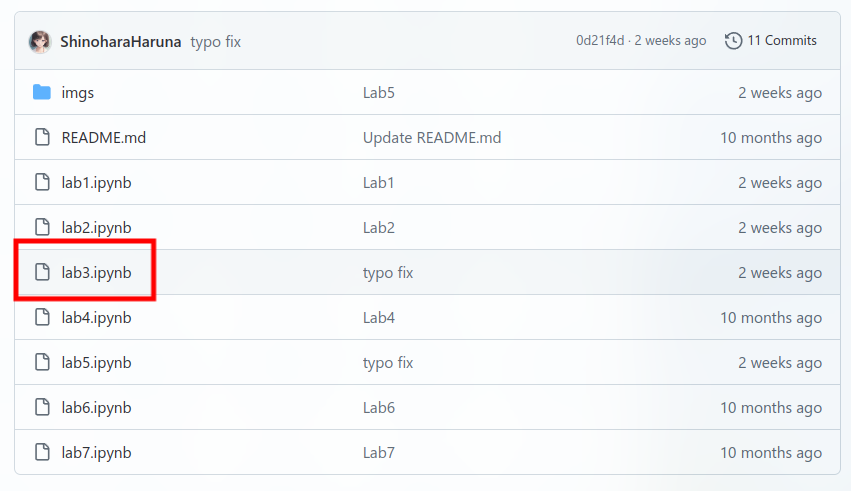
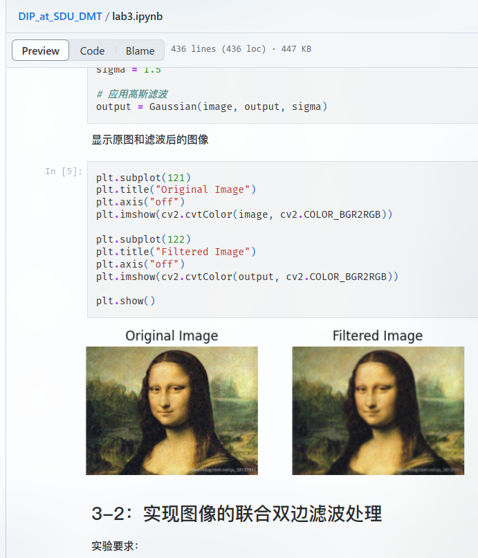

# DIP Experiments @ DMT of SDU

> 山东大学数字媒体技术专业，数字图像处理实验

随便写点。

    
一点吐槽

    我谢谢你啊数媒 

------

Lab7的人脸识别算是比较讨巧地做了，但是不涉及高级的视觉算法（Haar级联、神经网络等），只运用了最基本的数字图像处理算法。

## 使用方法

### 仅浏览

1. 直接访问：https://github.com/ShinoharaHaruna/DIP_at_SDU_DMT
2. 单击你想查看的实验项目（例如 Project 3，点击`lab3.ipynb`即可）

   

3. 可见：

   

### Make your own

- [ ] miniconda / anaconda（Optional）
- [x] Python 3，推荐 3.10及以上
- [x] Jupyter Notebook
- [x] 实验必要的库
- [ ] Visual Studio Code + Jupyter 插件（Optional）
